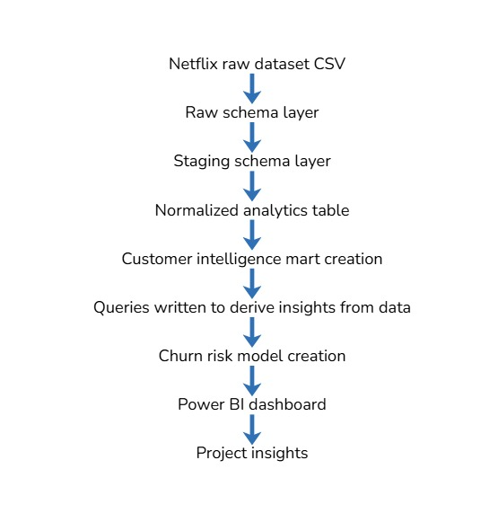
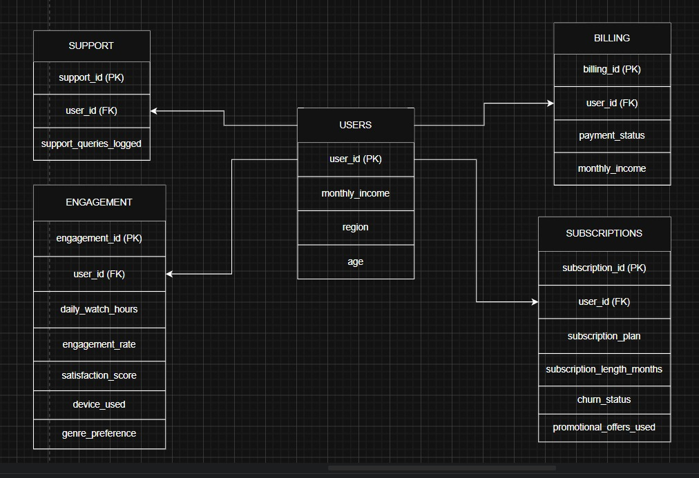

# NovaStream Customer Retention Analytics 

An end-to-end customer retention analytics project built using PostgreSQL, Neon, SQL, and Power BI. The project transforms raw customer data into actionable business insights through data modeling, churn analysis, customer segmentation, and dashboard reporting.

## Tech Stack

* PostgreSQL
* Neon
* SQL
* Power BI
* GitHub

## Architecture



## Data Model



The dataset was normalized into Users, Subscriptions, Engagement, Billing, and Support.<br>
A Customer Intelligence Mart was also developed for analysis.

## Dashboard Preview

### Executive Summary


### Churn Intelligence


### Behavioral Intelligence


### Revenue & Segmentation


### Churn Risk Model


---

## Key Findings

* Subscription tenure emerged as the strongest churn indicator.
* Customer satisfaction demonstrated a strong relationship with retention outcomes.
* Asia exhibited the highest churn concentration within the dataset.
* Standard plan subscribers experienced the highest churn rates.
* Delayed-payment customers displayed elevated churn behavior.
* Documentary-preferring customers exhibited the highest average churn-risk scores.
* Laptop users recorded the highest average watch hours, while Smart TV users recorded the lowest.
* A notable engagement anomaly was observed among customers aged 67.

---

## Project Structure

```text
novastream-retention-analytics/
├── sql/
├── docs/
├── diagrams/
├── images/
├── dashboard/
├── dataset/
└── README.md
```

---

## Documentation

Additional project documentation is available in:

* `docs/project_overview.md`
* `docs/methodology.md`
* `docs/key_insights.md`
* `docs/recommendations.md`
* `docs/limitations.md`

---

## Author

Snehita Debnath
B.Tech Computer Science & Engineering, IIT Jammu
